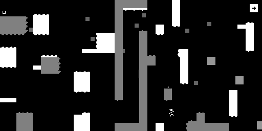
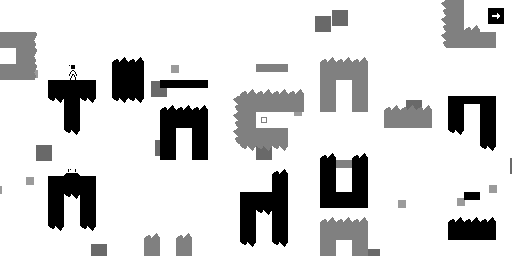

------

Monoman is a puzzle-platformer that I created out of sheer boredom while in school. It's
meant to be a remake of an old game I made, except with assets I made myself and code
that is not a total mess.

You play as this unnamed stick figure that somehow got stuck in a monochromatic reality.
However, you have the power to change the background color, changing what objects you
can interact with. Your goal is to escape this purgatory through the the "RGB Exit", the 
only colorful object in this world.

To run it:
- Install `pygame` with `pip` 
- Enter the project directory and run `python3 monoman.py`